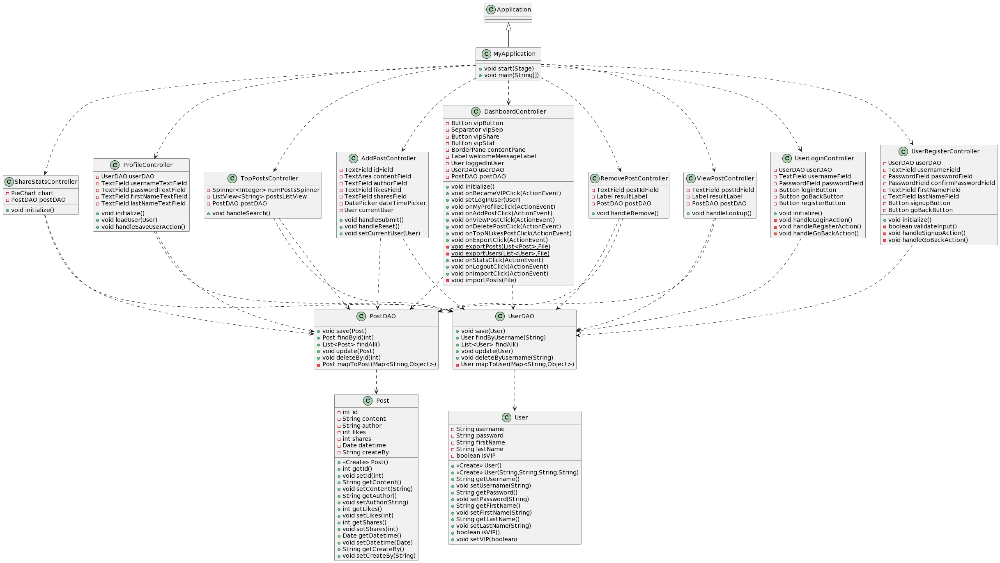

# DataAnalyticsProject

## The IDE used

Intellij IDEA

## The JDK version

java 17.0.6 2023-01-17 LTS

## The database used

SQLite

## How to install and run

1. Sync maven
2. Run MyApplication.java

## Object-Oriented Design:

- Created model classes Post and User to represent the core entities in the system. These follow proper encapsulation with private member variables and public getter/setter methods.
- Implemented data access objects PostDAO and UserDAO to abstract data persistence. These classes encapsulate all database access logic.
- Built controllers for each view that handle user events and display logic. Followed separation of concerns, with controllers focused on UI logic.
- Utilized inheritance by extending Application for the main app class MyApplication.

